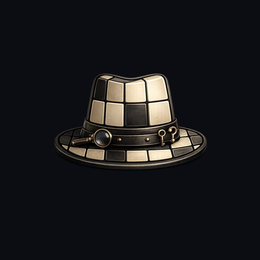
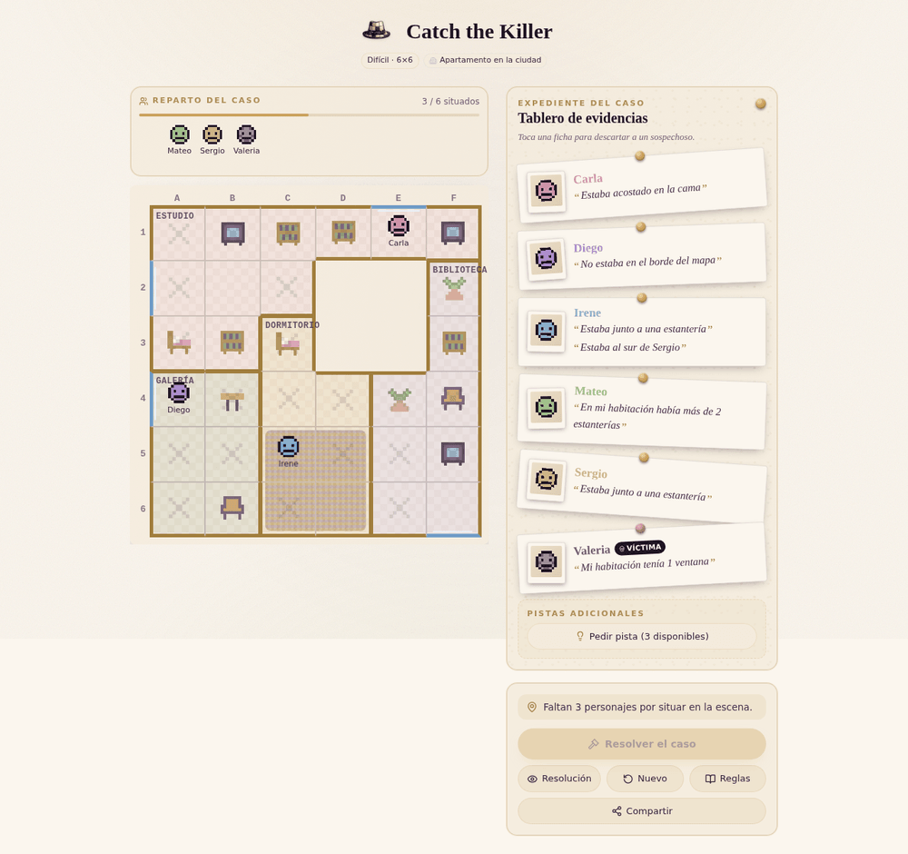

<p align="center">
  
</p>

# Catch the Killer

🔗 **Juega ahora en GitHub Pages:** https://dierodfer.github.io/CatchTheKiller/

**Reconstruye la escena del crimen, casilla a casilla.** Sitúa a cada
sospechoso en el mapa siguiendo las pistas, sin repetir fila ni columna con
nadie más. Cuando el tablero encaja, **el asesino se delata solo**: es quien
se queda a solas con la víctima en su habitación. Sin azar, sin trampas —
pura deducción, con cuatro dificultades y mapas irregulares para rejugar.

> Implementación **100% local**: la generación del mapa, la solución, las pistas
> y el Solver son lógica interna en JavaScript puro. No se llama a ninguna IA ni
> servicio externo.

<p align="center">
  
</p>

<p align="center"><sub>Caso en dificultad <strong>Difícil</strong> (6×6) con mapa irregular (forma "donut", con patio interior).</sub></p>

## Stack

| Componente        | Tecnología            | Por qué |
|-------------------|-----------------------|---------|
| Framework / build | **React 18 + Vite**   | Estándar ligero y rápido |
| Estilos           | **Tailwind CSS**      | Utilidades sin runtime |
| Iconos            | **lucide-react**      | Ligero y tree-shakeable, recomendado por la comunidad |
| Animaciones       | **framer-motion**     | La librería de animación más usada en React (layout, transiciones, reveals) |
| Drag & drop       | **@dnd-kit/core**     | Accesible y ligero; además hay *click-to-place* como alternativa |
| Estado            | **useReducer**        | Máquina de estados de la app (sección 13 del diseño) |

Sin toasts (decisión de diseño): el feedback se da en paneles y overlays.

## Dirección visual — "Botanica at Dawn"

Sistema de diseño cohesivo, premium y cálido (apps de _wellness_/_journaling_,
nunca casino): fondos cálidos en **crema/marfil**, **ciruela/plum** oscuro como
tinta de texto, **dorado** como acento principal, **verde sage** para el éxito
y **rosa polvoriento** para el error. Tipografía con carácter: serif editorial
**Cormorant Garamond** para los títulos + **Inter** para la interfaz. Los
tokens de color y tipografía viven en `src/index.css` (`@theme` de Tailwind v4).

- **Tres ambientaciones**, repartidas por la semilla del puzzle:
  - **Casa de montaña** — roble, hierro y lana; suelo de tarima, muros de
    nogal y alfombra de lana bereber.
  - **Apartamento en la ciudad** — un piso alto de rascacielos: cristal,
    acero y hormigón, baldosa de gran formato, ventanales de marco fino y
    alfombra de sisal.
  - **Mansión 8-bit** — el pixel art original, con su damero, su dorado, sus
    sprites de 8×8 y un kilim de bandas a todo color.

  Las dos primeras dibujan el mobiliario con sprites reales de Kenney
  (`furnitureSprites.js` — mesa, cómoda/TV, chimenea/planta, estantería, silla
  y cama, un set propio por zona, sin compartir dibujo entre sí); la tercera,
  con el emisor de pixel art original (`pixelArt.jsx`). La zona se parte en
  dos capas:
  `src/game/zones.js` guarda lo que la lógica necesita —qué zona toca a cada
  semilla y **cómo se llama cada elemento** en ella— y
  `src/components/zones.js`, cómo se ve (mobiliario, tintas, muros, ventanas y
  alfombra).

  Una zona puede **renombrar** elementos: en la casa de montaña la `planta` es
  una *chimenea* y la `TV` una *cómoda*, y las pistas lo dicen así. Lo que
  **no** puede cambiar es la lógica: el conjunto de ids y sus marcas
  `blocking`/`mueble` son del puzzle, no de la ambientación. La chimenea encaja
  precisamente porque comparte clase con la planta —estorba el paso y no es
  mobiliario—, así que la pista "no estaba junto a ningún mueble" sigue siendo
  cierta a su lado. Una aserción al cargar el módulo rechaza cualquier
  sustitución que se salga de su clase o que deje sin frase a un elemento
  pisable.

  **Las habitaciones también se renombran por zona** (`ZONE_ROOMS` en
  `game/zones.js`, mismo mecanismo): la `Terraza` es el *Porche* en la casa de
  montaña y el *Balcón* en el apartamento; el `Estudio` pasa a ser la
  *Armería* o el *Despacho*. El nombre CANÓNICO (el de `ROOM_NAMES`) sigue
  siendo la identidad real de la sala —la clave de `roomLookup`, la que
  indexa su tinte y su material de suelo—, así que renombrar una habitación
  nunca cambia de qué material está hecho su suelo ni qué tinte lleva; solo
  cambia la palabra que ve el jugador, tanto en el rótulo del tablero como en
  el texto de las pistas ("Estaba en la Alcoba"). Una aserción impide que dos
  salas de una misma zona terminen compartiendo nombre. La mansión 8-bit no
  redefine ninguna: conserva el vocabulario canónico en los diez tipos de
  habitación y en los seis elementos.

- **Un suelo por tipo de habitación** (`src/components/floorMaterials.js` +
  `floorSprites.js`), en las dos zonas de sprites: la sala manda el material y
  la zona manda el tinte. La Cocina lleva damero, la Biblioteca listones, la
  Bodega ladrillo, la Terraza losa de piedra, la Galería terrazo… diez sprites
  reales de 16×16 px (Kenney, ver créditos), no patrones CSS dibujados a mano.
  El material se elige por **nombre** de sala, no por el orden en que el
  generador la creó, así que una cocina se reconoce por su suelo tanto como por
  su rótulo; el tinte se indexa igual, por coherencia.

  Cada zona toca el suelo en un único punto: un `filter` CSS (sepia cálido en
  montaña, gris casi total en el apartamento) que se combina en `multiply` con
  el lavado de la habitación — así el COLOR de una sala lo sigue poniendo la
  zona, y el sprite solo aporta la textura. Se renderiza con
  `image-rendering: pixelated` para que el recorte no se difumine al escalar de
  16 px a una celda de hasta 112 px, y el tamaño del tile se ajusta a la celda
  para que el grano no se convierta en ruido cuando el tablero se comprime a
  36 px en móvil.

  **La mansión 8-bit se queda fuera de ese reparto**: declara `floor.pattern` y
  con eso puentea los sprites por sala, conservando su damero CSS de siempre —
  el mismo dibujo en las diez habitaciones, en `soft-light` al 55 % sobre el
  tinte. Allí el suelo no tiene que distinguir una sala de otra, que de eso ya
  se encarga el tinte: tiene que sostener la textura pixelada del conjunto, y
  un sprite distinto por sala rompía justo esa unidad.
- **Alfombra en tres capas** (`Rug.jsx` + `rugLayerStyles`): la alfombra no se
  dibuja por celda — es UNA capa a nivel de tablero, posicionada sobre el
  rectángulo exacto que ocupa (de una tira de 1×6 a un bloque de 3×2, ver
  `placeRug` en `mapGenerator.js`). Dibujarla por celda obligaría a resolver a
  mano qué canto es borde y cuál interior. Las celdas de alfombra quedan con
  fondo transparente para que se vea a través; fichas, marcas y línea de
  control siguen pintándose por delante porque van dentro de la celda, más
  tarde en el documento.

  Son tres capas apiladas, y el orden importa: el **suelo de la habitación**
  (en todo el rectángulo), el **ribete** y el **tejido** dentro del ribete. La
  primera cubre el rectángulo entero aunque las otras dos no lleguen a sus
  bordes, y ahí está su razón de ser: por la franja de `inset` y por los huecos
  de las esquinas redondeadas se ve suelo, y las celdas de debajo van
  transparentes, así que sin ella ese contorno daría al vacío del tablero en
  vez de al suelo de la sala. Las otras dos van separadas porque el `filter` de
  la zona es del TEJIDO, no de la alfombra entera: aplicado al conjunto
  arrastraría también el color del ribete y la zona dejaría de poder elegirlo.

  **La alfombra no llega a los muros.** `insetFrac` la separa del canto de las
  celdas que ocupa —un 10 % de la celda por lado, así que una tira de una sola
  celda de ancho conserva el 80 %— y por esa franja se ve el suelo. Encajada al
  milímetro entre cuatro paredes se leía como moqueta, parte de la obra; lo que
  se busca es una pieza suelta apoyada encima. La medida va en píxeles sobre la
  celda y no en porcentaje del rectángulo: la alfombra puede ser una tira de
  1×6, y un porcentaje dejaría allí una franja seis veces más ancha por los
  extremos que por los lados.

  El ribete lo fija cada zona (`zone.rug.border`, `borderFrac`, `radiusFrac`) y
  se mantiene deliberadamente discreto —un trazo apenas más oscuro que el
  propio tejido, no un marco que compita con él—: cuero en la casa de montaña,
  taupe casi confundido con el sisal en el apartamento, nogal en la mansión.
  Grosor y radio son proporcionales a la celda, no fijos. La mansión 8-bit es
  la única con `radiusFrac: 0` — en una rejilla de píxeles no hay curvas, y
  redondear delataría que el marco no está dibujado a la misma resolución que
  el resto de su arte —, y también la del ribete más ancho de las tres: a esa
  uno de dos píxeles no se lee.
- **Texturas de alfombra** (`rugTextures.js`): cuatro tiles de 64×64 px que
  embaldosan sin costura, generados a **resolución de hilo**: cada píxel es una
  pasada de trama, una hebra o un nudo, con su sección redondeada, la
  irregularidad de la hilatura y el grano de la fibra. Por eso se leen como
  tejido y no como un tinte a rayas, que es lo que fallaba cuando el relleno
  eran degradados CSS.

  | Textura | Qué es |
  |---|---|
  | `kilim` | Bandas lisas alternadas con rombos y galones, a resolución de pasada |
  | `berber` | Campo de fibra corta y tupida con enrejado de rombos en tinta |
  | `sisal` | Esterilla de cuadros: hebras naturales que alternan dirección |
  | `persa` | Medallones de rombo sobre campo granate, tejido de nudo fino |

  La zona elige cuál usa (`zone.rug.texture`) y la tiñe con su `filter`, igual
  que hace con los suelos: montaña lleva `berber`, el apartamento `sisal` y la
  mansión 8-bit `kilim`. Las cuatro quedan disponibles, así que cambiar la
  ambientación de una zona es cambiar una sola línea. El tile se escala con la
  celda —no a tamaño fijo— para que el motivo siga completo en una tira de una
  sola celda de alto y no se convierta en ruido a 36 px en móvil.

  El `filter` de la alfombra es **suyo, no el del suelo**: los tiles de tejido
  son más claros que los de baldosa, así que un `brightness` por encima de 1
  quema la fibra y borra justo lo que hace que se lean como tejidos. Por lo
  mismo el apartamento desatura la alfombra menos que el suelo (0.55 frente a
  0.75): sin nada de tono, el sisal queda gris y deja de contrastar con el
  hormigón.
- **Celebración al resolver**: al cerrar el caso de verdad, la escena se
  ilumina **habitación por habitación** sobre el tablero (Framer Motion) y un
  overlay editorial con pétalos dorados presenta el desenlace.
- **Accesibilidad**: contraste cuidado sobre el fondo claro, foco visible en
  dorado y respeto de `prefers-reduced-motion` (global en CSS + `useReducedMotion`
  en los componentes animados). Diseño _mobile-first_ y responsive.

### ¿Se usa TypeScript?

**No.** El proyecto está en JavaScript puro (`.js` / `.jsx`), sin `tsconfig.json`
ni archivos `.ts`/`.tsx`. Las dependencias `@types/react` y `@types/react-dom`
solo se incluyen para que el editor ofrezca autocompletado y tipado de las
props de React sobre los `.jsx`, pero no hay comprobación de tipos en el build
ni en el lint. Si se quisiera migrar a TypeScript más adelante, el código de
`src/game/` (sin JSX, lógica pura) sería el más sencillo de tipar primero.

## Cómo ejecutar

```bash
npm install
npm run dev        # desarrollo (http://localhost:5173)
npm run build      # build de producción en dist/
npm run preview    # sirve el build
npm run test:logic # smoke test de la lógica de generación (sin UI)
```

## Despliegue a GitHub Pages

El workflow `.github/workflows/deploy.yml` construye el proyecto y lo publica
en GitHub Pages automáticamente con cada push a `main` (o manualmente desde la
pestaña *Actions*).

Para activarlo, en el repositorio: **Settings → Pages → Build and deployment →
Source: "GitHub Actions"**. La app quedará disponible en
`https://<usuario>.github.io/<repositorio>/`. El `base: './'` en
`vite.config.js` hace que las rutas de los assets sean relativas, por lo que
funciona en cualquier subruta sin tocar configuración adicional.

## Arquitectura

La lógica del juego vive en `src/game/` y es independiente de la UI:

### Elementos del mapa (`src/game/elements.js`)

Registro central de todos los objetos que pueden aparecer en el tablero. Cada
elemento se identifica por un `id` estable (el valor en `map.grid`). Los
atributos de presentación (`label`, y en el futuro icono/sprite) se resuelven
por ese id, lo que permite re-tematizar nombre e imagen por ambiente/zona sin
tocar la lógica del juego.

| id | label | blocking | mueble | pista "encima de" |
|----|-------|:--------:|:------:|-------------------|
| `mesa` | mesa | sí | sí | — |
| `TV` | TV | sí | sí | — |
| `planta` | planta | sí | no | — |
| `estantería` | estantería | sí | sí | — |
| `silla` | silla | no | sí | *Estaba sentado en una silla* |
| `alfombra` | alfombra | no | no | *Estaba sobre la alfombra* |
| `cama` | cama | no | sí | *Estaba acostado en la cama* |

- **blocking**: la celda queda inaccesible; ningún personaje puede ocuparla.
- **mueble**: solo los marcados como mueble cuentan para la pista *"No estaba
  junto a ningún mueble"*. Planta y alfombra no se consideran muebles.
- **Todos** los elementos pueden aparecer en pistas de proximidad (*"Estaba
  junto a una X"*), incluidas planta y alfombra.
- Listas derivadas: `BLOCKING_ELEMENTS`, `FREE_ELEMENTS`, `MUEBLE_ELEMENTS`,
  `PROXIMITY_ELEMENTS`, `ON_ELEMENTS`.

### Estructura de archivos

```
src/game/
  elements.js           Registro central de elementos del mapa (ver tabla arriba)
  constants.js          Dificultades, habitaciones, parámetros de generación
  random.js             PRNG determinista (semilla reproducible)
  mapGenerator.js       Cuadrícula + habitaciones irregulares + mobiliario + ventanas
  solutionGenerator.js  Coloca personajes (filas/columnas propias) garantizando 1 asesino
  killerRule.js         Regla del asesino (a solas con la víctima en su sala, líneas despejadas)
  clues.js              Catálogo de tipos de pista + evaluador verificable
  clueGenerator.js      Deriva pistas de la solución y busca solución única
  hints.js              Elige qué pista adicional conceder según el tablero
  solver.js             Autoridad final: unicidad, validación, identifica al asesino
  puzzleGenerator.js    Orquesta: mapa → solución → pistas → validación
```

Flujo de generación (sección 6 del diseño), todo local:

```
GENERAR MAPA → GENERAR SOLUCIÓN → GENERAR PISTAS → SOLVER (unicidad) → VALIDACIÓN
```

El Solver es la **autoridad final**: ningún conjunto de pistas se acepta sin que
el Solver confirme que produce exactamente una reconstrucción válida (con
exactamente un asesino). Si un sospechoso queda ambiguo, se añade una pista
adicional para él (sección 6.4) y luego se minimizan las redundantes.

### UI (`src/components/`)

- `Board` / `Cell` — cuadrícula con **filas y columnas numeradas**, habitaciones,
  mobiliario, ventanas y la **línea de control** (un aspa en cada celda de la
  fila y la columna de cada ficha colocada, en tiempo real; útil para comprobar
  que ningún personaje comparte fila ni columna con otro). El aspa es SVG
  vectorial (`ControlMark.jsx` + `controlMarks.js`), con cuatro variantes
  disponibles —`lapiz`, `fina`, `canto`, `recortada`— y la activa en la
  constante `CONTROL_MARK`. Se escala con la celda, así que el trazo sale igual
  de limpio a 95 px que a los 36 px del móvil; la rejilla de 8×8 píxeles que
  sustituye se deshacía en cuatro puntos sueltos a tamaño pequeño. No se
  tematiza a propósito: es una señal de juego, y significa lo mismo en las tres
  zonas. Las ventanas se dibujan sobre la pared de
  la celda (no en el suelo) y son ocupables. Las alfombras pueden ocupar entre 2
  y 6 celdas formando una región rectangular.
- `CharacterTray` — fichas sin colocar (orden alfabético), situada justo encima
  del tablero; zona para descolocar.
- `CluePanel` — pistas agrupadas por personaje (orden alfabético), marcables como
  usadas. Ninguna pista referencia a la víctima. Las pistas adicionales se
  representan como **lupas** en pixel art (una por pista disponible, según la
  dificultad): tocar una la gasta y su aro dorado pasa a gris tachado. La pista
  que se concede depende *del tablero*, no del azar: primero sobre los
  personajes que el jugador aún no ha colocado y después sobre los que están
  mal colocados (`src/game/hints.js`).
- `Toolbar` — Resolver, Resolución (revela la solución tras un aviso), Nuevo.
- `ResultBanner` — WIN revela al asesino y la habitación del crimen (se puede
  cerrar para inspeccionar el tablero); FAIL indica que hay errores **sin revelar
  la solución**.
- `MapPreview` — previsualización de solo lectura del tipo de mapa que generará
  la dificultad seleccionada, visible en la pantalla de inicio.

Colocación por **arrastre** (dnd-kit) o **click-to-place** (seleccionar ficha y
pulsar la celda).

## Estado del proyecto

Primer hito jugable de extremo a extremo para las cuatro dificultades
(4×4 / 5×5 / 6×6 / 7×7). La capa de generación es local; si en el futuro se
quiere delegar la generación de solución/pistas a un modelo, basta con
sustituir `solutionGenerator` + `clueGenerator` respetando el contrato de
datos (sección 10 del diseño), manteniendo el Solver como autoridad final.

La partida en curso se guarda localmente (`localStorage`) y se ofrece
continuarla si se recarga la página a mitad de un caso.

Cuestiones aún abiertas del diseño (sección 15): revelado progresivo de pistas,
sistema de puntuación y multijugador.

## Créditos y licencias de terceros

- **Roguelike/RPG pack** (Kenney) — los 10 sprites de suelo
  (`src/components/floorSprites.js`) y los 12 sprites de mobiliario de «Casa de
  montaña» y «Apartamento en la ciudad» (`furnitureSprites.js`, 6 elementos ×
  2 zonas).
  Licencia CC0 1.0 (dominio público, no exige atribución); texto de cortesía
  en [`LICENSES/kenney-roguelike-rpg-pack-CC0.txt`](LICENSES/kenney-roguelike-rpg-pack-CC0.txt).
  Cada sprite es un recorte de 16×16 px del spritesheet oficial, embebido como
  PNG en base64: cero peticiones en
  tiempo de ejecución, porque la app es una PWA offline.
- El pixel art de la zona «Mansión 8-bit», los retratos de los personajes y la
  lupa son originales del proyecto.
